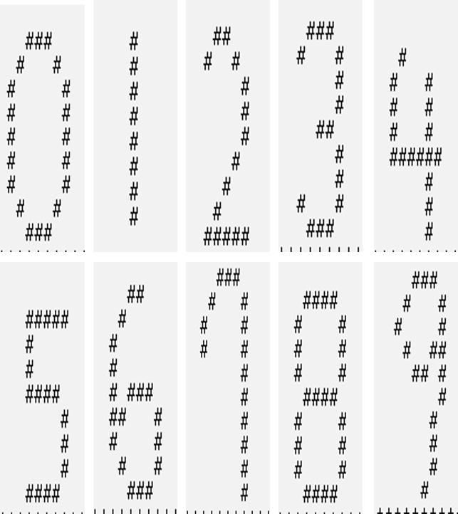
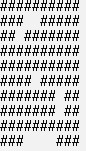
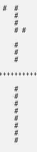

# Hopfield Network

## 1. 과제 개요

 Hopfield Network를 이용한 숫자 인식 시스템 구현 ... 0~9까지 숫자 인식. 


## 2. 알고리즘 구조

자기조직화맵(SOM)이나 인공신경망에서 가장 많이 사용되는 퍼셉트론(perceptron) 등은 연산이나 학습 과정에서 지속적으로 가중치(weight)가 변경되는 알고리즘이다. 다른 알고리즘과 다르게 홉필드 네트워크(Hopfield network)는 고정된 가중치를 이용하여 완전한 정보를 연상하는 차이점이 있다. 홉필드 네트워크는 학습 패턴에 대해 계산된 고정 가중치 행렬을 저장하고, 입력 패턴이 들어올 때마다 가중치 행렬을 이용하여 입력 패턴에 대한 학습 패턴을 연상하면 된다. 홉필드 네트워크 알고리즘은 아래와 같다.


1) 학습 패턴에 양극화 연산을 적용

2) 학습 패턴에 대한 홉필드 네트워크의 가중치 행렬을 계산

3) 계산된 가중치 행렬을 저장

4) 입력 패턴이 들어오면 저장된 가중치 행렬을 이용하여 입력 패턴에 대한 학습 패턴을 연상


## 3. 연산 정의

학습 패턴의 ii번째 입력 값인 aiai에 대해 양극화된 값 xixi는 아래와 같이 연산된다.


해당 연산을 통해 학습 패턴의 입력 값이 1이면 값이 그대로 유지되고, 0이면 값이 -1로 변경된다.

양극화된 학습 패턴이 xixi라고 할 때, 학습 패턴에 대한 가중치 행렬 계산은 아래와 같이 수행한다. 여기에서 ww는 학습 패턴에 대한 홉필드 네트워크의 가중치 행렬을 나타내고, II는 단위행렬(identity matrix)를 뜻한다.


## 4. 숫자 디자인

* 10 x 10 행렬에  최대한 중복되는 영역이 없도록 디자인하였습니다.




## 5. 양극화 연산 적용


* 2차원 행렬을 1차원 행렬로 변환 후 양극화 연산

```c++
vector<vector<vector<int>>> numV{v0, v1, v2, v3, v4, v5, v6, v7, v8, v9};
vector<int> colV(100);

for (int j = 0; j < 10; j++) {
    colV[(10 * i) + j] = (numV[v][i][j] * 2) - 1;
}
```


## 6. 가중치 행렬 저장


* 0부터 9까지의 행렬을 가중치 행렬에 저장
* 행과 열의 index가 같은 경우 0

```c++
vector<vector<int>> weightV(100, vector<int>(100, 0));

// 가중치 행렬 계산
for (int v = 0; v < numV.size();v++) {
    // 2차원 행렬을 1차원 행렬로 변환 (양극화 연산)
    for (int i = 0; i < 10; i++) {
        for (int j = 0; j < 10; j++) {
            colV[(10 * i) + j] = (numV[v][i][j] * 2) - 1;
        }
    }
    // 변환된 2차원 행렬과 그 역행렬을 곱하여 가중치 행렬에 더함.
    for (int i = 0; i < 100; i++) {
        for (int j = 0; j < 100; j++) {
            // 행과 열의 index가 같은 경우 0
            if (i != j) weightV[i][j] += (colV[i] * colV[j]);
        }
    }
}
```


## 7. 입력 패턴에 대한 학습 패턴 연상

입력 패턴에 의해 연상되는 학습 패턴을 구하기 위해서는 아래와 같은 3단계의 반복이 필요하다.

① 행렬의 곱 연산을 이용하여 가중치 행렬과 입력 패턴을 곱한다.

② 곱해서 나온 행렬을 활성화 함수에 입력한다.

③ 연산에 의해 계산된 패턴이 학습 패턴 중 하나라면 알고리즘을 종료하고, 아니면 ①을 반복한다.

먼저 입력 패턴의 한 요소에 대한 threshold를 계산한다. threshold의 뜻은 계산 값이 threshold 이상일 때만 그 값을 활성화한다는 의미이다. 입력 패턴의 ii번째 요소에 대한 threshold는 아래와 같이 계산된다.


그 다음, 입력 패턴의 다음 요소는 아래와 같은 식에 의해 계산된다.


마지막으로 계산된 입력 패턴의 다음 요소는 아래와 같은 활성화 함수를 통해 최종적으로 값이 변경된다.


```c++
	while(1) {
		for (int a = 0; a < 100; a++) {
			int sum = 0;
			for (int i = 0; i < 10; i++) {
				for (int j = 0; j < 10; j++) {
					sum += inputV[i][j] * weightV[a][(i * 10) + j];
				}
			}
            // 활성함수 적용
			if (sum > 0) {
				inputV[a / 10][a % 10] = 1;
			}
			else if (sum < 0) {
				inputV[a / 10][a % 10] = 0;
			}
		}
        // 일치하는 학습패턴이 있는지 확인
		for (auto v : numV) {
			int a, b;
			for (a = 0; a < v.size(); a++) {
				for (b = 0; b < v.size(); b++) {
					if (v[a][b] != inputV[a][b]) break;
				}
			}
			if (a == v.size() && b == v.size()) {
				printArr(inputV);
				return 0;
			}
		}
	}
```


## 8. 테스트

### 노이즈를 첨가한 1

>  error bit 3개 추가


### 결과



실제 결과는 동일한 결과가 나올때까지 돌려야하지만 1000번의 반복에도 값이 변하지 않기에 종료하였습니다.

잘못된 결과의 원인을 알기위해 몇가지 실험을 한 결과 weighted 행렬에 조금 문제가 있었습니다.

학습을 2개의 행렬로 학습한 경우 제대로된 결과가 나오는 것을 확인할 수 있었지만 3개 이상의 행렬로 학습을 할 시 가중치 행렬의 값이 이상하게 변하는 것을 확인하였습니다.

### 1과 3의 행렬로 가중치를 구한 경우

### 가중치 행렬 계산 코드

```c++
// 가중치 행렬 계산
for (int v = 0; v < numV.size();v++) {
    if (v == 1 || v == 3) {
        // 2차원 행렬을 1차원 행렬로 변환
        for (int i = 0; i < 10; i++) {
            for (int j = 0; j < 10; j++) {
                colV[(10 * i) + j] = (numV[v][i][j] * 2) - 1;
            }
        }
        // 변환된 2차원 행렬과 그 역행렬을 곱하여 가중치 행렬에 더함.
        for (int i = 0; i < 100; i++) {
            for (int j = 0; j < 100; j++) {
                if (i != j) weightV[i][j] += (colV[i] * colV[j]);
            }
        }
    }
}
```

#### 결과

한번만에 제대로된 결과를 얻을 수 있었습니다.




## 결론

인터넷에 있는 여러 예제들을 참고했을때 2개의 학습패턴으로만 한 경우가 있고 3개 이상의 학습패턴을 적용한 예제는 없었습니다. 3개 이상의 학습패턴으로 가중치 행렬을 구한 결과 값이 이상하게 나오는 것을 확인할 수 있었으며 2개의 학습패턴으로 학습했을 시 제대로된 결과를 얻었습니다.

2개의 학습패턴으로 학습했을 때에도 error bit 3개 까지만 허용되고 4개 이상의 noise가 있을 때 제대로된 결과를 도출하지 못하였습니다.